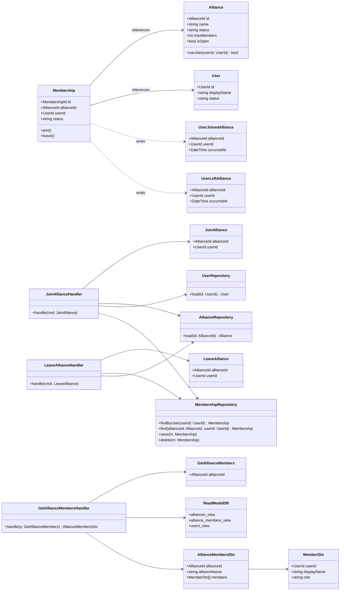

```mermaid
classDiagram
direction LR

class Alliance {
  +AllianceId id
  +string name
  +string status
  +int maxMembers
  +bool isOpen
  +canJoin(userId: UserId) bool
}

class User {
  +UserId id
  +string displayName
  +string status
}

class Membership {
  +MembershipId id
  +AllianceId allianceId
  +UserId userId
  +string status
  +join()
  +leave()
}

class JoinAlliance {
  +AllianceId allianceId
  +UserId userId
}

class LeaveAlliance {
  +AllianceId allianceId
  +UserId userId
}

class UserJoinedAlliance {
  +AllianceId allianceId
  +UserId userId
  +DateTime occurredAt
}

class UserLeftAlliance {
  +AllianceId allianceId
  +UserId userId
  +DateTime occurredAt
}

class JoinAllianceHandler {
  +handle(cmd: JoinAlliance)
}

class LeaveAllianceHandler {
  +handle(cmd: LeaveAlliance)
}

class AllianceRepository {
  +load(id: AllianceId) Alliance
}

class UserRepository {
  +load(id: UserId) User
}

class MembershipRepository {
  +findByUser(userId: UserId) Membership
  +find(allianceId: AllianceId, userId: UserId) Membership
  +save(m: Membership)
  +delete(m: Membership)
}

class GetAllianceMembers {
  +AllianceId allianceId
}

class GetAllianceMembersHandler {
  +handle(q: GetAllianceMembers) AllianceMembersDto
}

class AllianceMembersDto {
  +AllianceId allianceId
  +string allianceName
  +MemberDto[] members
}

class MemberDto {
  +UserId userId
  +string displayName
  +string role
}

class ReadModelDB {
  +alliances_view
  +alliance_members_view
  +users_view
}

%% Relationships
JoinAllianceHandler --> JoinAlliance
LeaveAllianceHandler --> LeaveAlliance

JoinAllianceHandler --> AllianceRepository
JoinAllianceHandler --> UserRepository
JoinAllianceHandler --> MembershipRepository

LeaveAllianceHandler --> MembershipRepository
LeaveAllianceHandler --> AllianceRepository

Membership --> Alliance : references
Membership --> User : references

Membership ..> UserJoinedAlliance : emits
Membership ..> UserLeftAlliance : emits

GetAllianceMembersHandler --> GetAllianceMembers
GetAllianceMembersHandler --> ReadModelDB
GetAllianceMembersHandler --> AllianceMembersDto
AllianceMembersDto --> MemberDto

```
